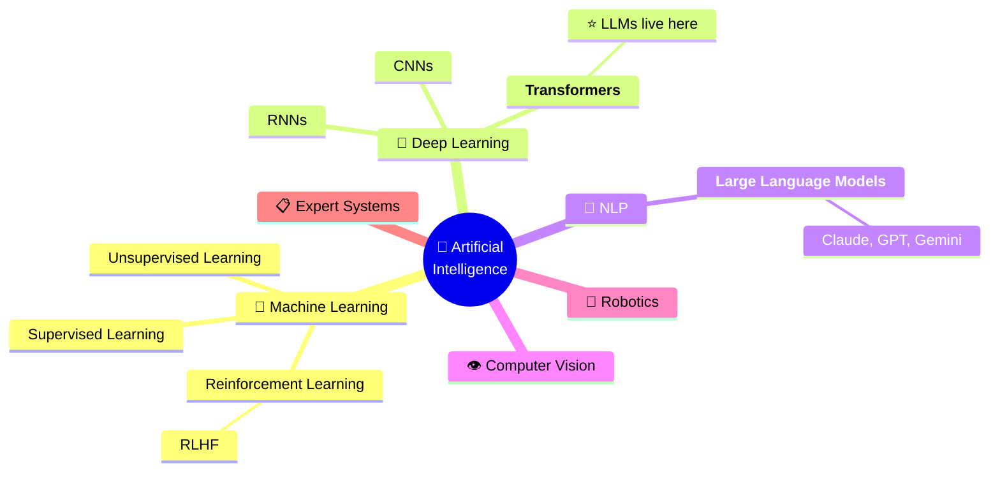
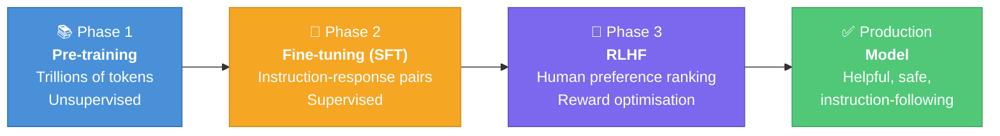
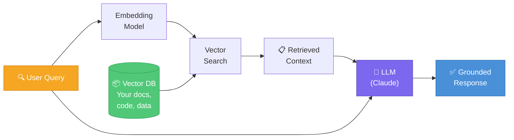
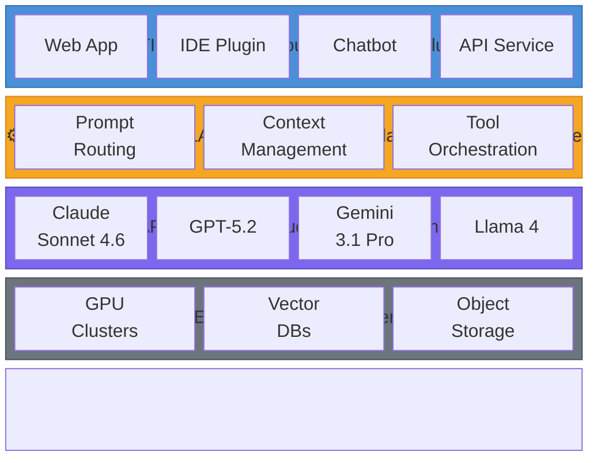
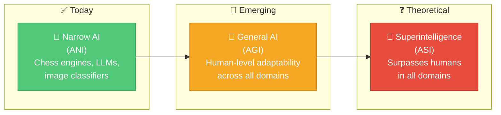

# Article 1: What Is AI? A Developer's No-Nonsense Guide to Artificial Intelligence

> *From neural networks to Claude Sonnet 4.6 and GPT-5.2 — understanding what AI actually is, how it works, and why it matters more than ever.*

---

## Introduction

Artificial Intelligence is no longer a science-fiction concept. It's the autocomplete in your IDE, the bug detector in your CI pipeline, the chat widget on your company's website, and the engine behind multi-billion-dollar products built in months by two-person teams.

Yet most developers treat AI as a black box — something you throw a prompt at and hope for a sensible response. That approach works until it doesn't. To use AI effectively, especially in professional software development, you need to understand *what it actually is*, how it reasons, and where it breaks down.

This article is the first in a 14-part series. We're going from zero to production-grade AI usage across development, QA, and business analysis roles. Let's start at the foundation.

---

## 1. What Is Artificial Intelligence?

AI is the field of computer science concerned with building systems that can perform tasks that would normally require human intelligence — things like understanding language, recognising patterns, making decisions, and generating creative content.

The term was coined in 1956 by John McCarthy at the Dartmouth Conference, but the ideas go back further — Alan Turing's 1950 paper *Computing Machinery and Intelligence* asked: "Can machines think?"

**The core goal of AI:** Build systems that can *generalise* — not just perform a specific task, but adapt to new inputs they haven't seen before.

---

## 2. The AI Family Tree

AI is an umbrella term. Here's how the major subfields relate:

> 🎯 **Key Insight:** Modern AI tools like Claude, GPT, and Gemini are all **Large Language Models** — a type of deep learning model built on the **Transformer** architecture.

For software engineers today, the most relevant branch is **Large Language Models (LLMs)** — a type of deep learning model built on the Transformer architecture.

---

## 3. How Do Large Language Models Work?

### The Transformer Architecture

In 2017, researchers at Google published *Attention Is All You Need*, introducing the Transformer architecture. This was a paradigm shift.

Before Transformers, sequence-to-sequence models like RNNs processed text word by word — slow and forgetful of long-range context. Transformers process entire sequences in parallel using a mechanism called **self-attention**.

**Self-attention** allows a model to weigh how relevant each word in a sentence is to every other word — simultaneously. This is why modern LLMs can understand nuanced context across thousands of tokens.

### Training an LLM: The Three Phases

**Phase 1 — Pre-training**  
The model is trained on a massive corpus of text (books, code, articles, websites). It learns to predict the next token given a sequence. This is unsupervised — no labels, just patterns. Models like Claude Sonnet 4.6 and GPT-5.2 were trained on trillions of tokens.

**Phase 2 — Fine-tuning / SFT (Supervised Fine-Tuning)**  
The pre-trained model is fine-tuned on curated instruction-response pairs. This teaches it to follow instructions rather than just predict the next word.

**Phase 3 — RLHF (Reinforcement Learning from Human Feedback)**  
Human raters compare model outputs and rank them. A reward model is trained on these preferences. The LLM is then optimised using reinforcement learning to produce outputs the reward model rates highly. This is what makes models feel "helpful" and "safe."

### What Is a Token?

Tokens are the units LLMs operate on — roughly 0.75 words each. "Hello, developer!" is 4 tokens. This matters because:
- **Context window** = the maximum tokens the model can process at once
- **Cost** is often calculated per token
- Long files, big codebases, and lengthy conversations can exhaust context

---

## 4. Key Concepts Every Developer Must Know

### 4.1 Context Window
The context window is the model's "working memory." Everything — your system prompt, conversation history, documents, and current message — must fit inside it. Modern models range from 32K to 1M+ tokens (Claude and GPT-5.2 offer 200K; Gemini 3.1 Pro reaches 1M).

**Practical impact:** A 200K token window can hold roughly 150,000 words — about half a novel, or a moderately-sized codebase. Exceeding the window causes the model to "forget" earlier content.

### 4.2 Temperature
Temperature controls randomness in token selection. Range: 0.0–1.0 (sometimes up to 2.0).
- **Temperature 0:** Deterministic, always picks the most probable token. Best for code, data extraction, classification.
- **Temperature 1:** More creative, varied outputs. Best for brainstorming, writing.

### 4.3 Top-P (Nucleus Sampling)
Limits token selection to the smallest set of tokens whose cumulative probability exceeds P. Combined with temperature, this controls the "creativity vs. coherence" tradeoff.

### 4.4 System Prompt
A privileged instruction at the start of the conversation that shapes the model's behaviour, persona, and constraints. This is where you set the stage.

### 4.5 Hallucination
LLMs can confidently produce false information. They are pattern-completion machines — they don't "know" facts, they predict plausible continuations. This is the #1 failure mode to engineer around.

### 4.6 Embeddings
Numerical vector representations of text. Used for semantic search, RAG (Retrieval-Augmented Generation), and recommendation systems. Similar meaning → similar vectors → close together in vector space.

### 4.7 RAG (Retrieval-Augmented Generation)

Instead of relying solely on the model's training data, RAG retrieves relevant documents from an external store (vector DB) and injects them into the context. This grounds the model in facts and enables up-to-date knowledge.

---

## 5. The AI Stack — Where LLMs Fit

> 👨‍💻 As a developer, you primarily operate at the **Application** and **Orchestration** layers, consuming the LLM API.

As a developer, you primarily operate at the **Application** and **Orchestration** layers, consuming the LLM API.

---

## 6. Narrow AI vs. General AI vs. AGI

**Narrow AI (ANI)** — Does one thing very well. Chess engines, spam filters, image classifiers, current LLMs. This is what exists today.

**General AI (AGI)** — Can perform any intellectual task a human can, with human-level adaptability. Does not yet exist in the full sense, though the gap is narrowing rapidly.

**Artificial Superintelligence (ASI)** — Surpasses human intelligence across all domains. Theoretical.

Current LLMs like Claude Sonnet 4.6 are extraordinarily capable narrow systems — they can *reason* and *generalise* across many domains, but they are still fundamentally prediction machines with significant limitations.

---

## 7. Why AI Matters for Developers Right Now

The productivity shift is empirical and measurable:

- GitHub Copilot users complete tasks **55% faster** (GitHub, 2022 study)
- Developers using AI tools spend less time on boilerplate and more on architecture
- QA cycles are shortening as LLMs help generate test cases and find edge cases
- Documentation that used to take days now takes hours

But beyond raw speed, the more profound shift is **democratisation of capability**. A solo developer with Claude can now produce work that previously required a team — not because AI replaces engineers, but because it eliminates the long tail of low-value work that consumes 40–60% of a typical sprint.

---

## 8. The Limits You Must Respect

Using AI without understanding its limits is how teams ship hallucinated data, broken migrations, and security vulnerabilities.

| Limitation | Risk Level | What It Means in Practice |
| :--- | :---: | :--- |
| **Hallucination** | 🔴 Critical | Always verify facts, API signatures, and version numbers before shipping |
| **Knowledge cutoff** | 🟡 High | Training data has a date — never trust AI answers on current library versions |
| **Context window** | 🟡 High | Large codebases exhaust limits; use chunking or RAG for >100K token inputs |
| **Non-determinism** | 🟡 High | Same prompt yields different outputs — design systems to handle variance |
| **No real memory** | 🟠 Medium | Each conversation starts fresh unless you use memory tools or context injection |
| **No persistent state** | 🟠 Medium | LLMs are stateless — all state management is your application's responsibility |
| **Reasoning errors** | 🟠 Medium | Multi-step maths and logic can silently fail — verify any critical computation |
| **Prompt injection** | 🔴 Critical | Untrusted input can hijack AI behaviour — sanitise user input in AI pipelines |

---

## 9. Responsible AI: Not Just Ethics Theatre

As a developer building with AI:

- **Privacy:** Don't send PII, credentials, or proprietary source code to third-party APIs without explicit data-handling agreements.
- **Bias:** Models carry biases from training data. In automated decision systems, audit outputs.
- **Attribution:** AI-generated code can inadvertently reproduce licensed code. Review outputs for your use case.
- **Security:** AI-generated code is not inherently safe. Run the same security reviews you would on any human-written code.

---

## Summary

AI — specifically large language models — works by predicting the most contextually appropriate continuation of a sequence, trained on massive corpora via gradient descent, refined by human feedback. Its power comes from pattern recognition at enormous scale. Its limits come from the same place: it is always approximating, never truly "knowing."

As a developer, this means:
1. AI is a **powerful collaborator**, not an oracle.
2. **Verification is non-negotiable** for any output you ship.
3. Understanding the mechanics lets you **design prompts and systems** that extract consistently high-quality output.

In the next article, we'll explore where exactly AI can be applied — from code generation to test automation, business intelligence to documentation — and which problems are genuinely AI-appropriate vs. hype.

---

*Next: Article 2 — Where Can We Use AI? A Comprehensive Map of AI Applications in Software Engineering*
