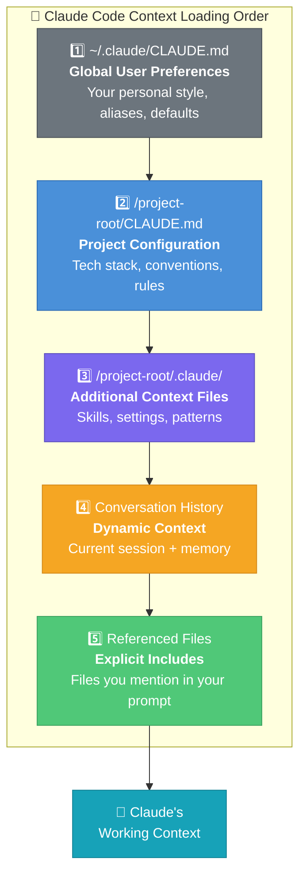
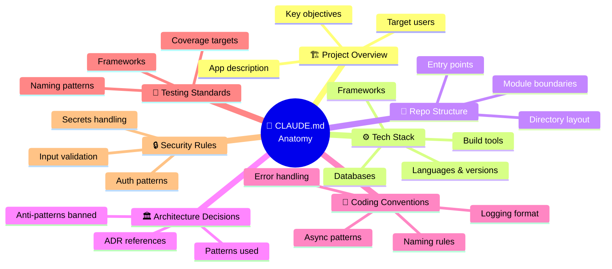
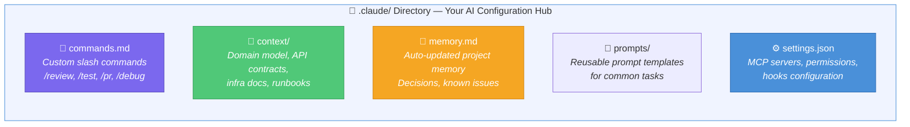
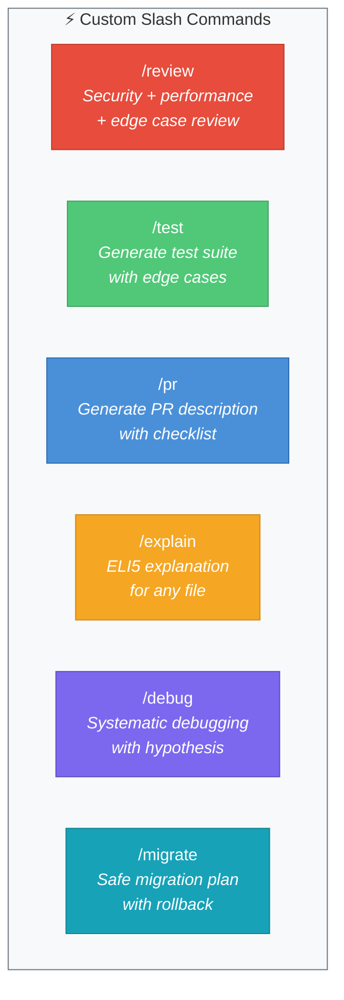
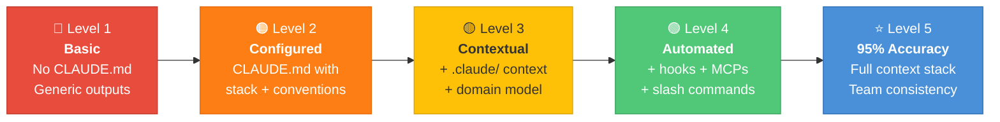

# Article 8: The CLAUDE.md System — What Files You Need to Achieve 95% Accuracy

> *The difference between a generic AI tool and a precision instrument for your codebase is context. This article shows you exactly what files to create, what to put in them, and why they matter.*

---

## Introduction

When you start Claude Code in a project, Claude reads specific files to understand your codebase before responding to any request. This isn't magic — it's structured context loading. The quality of these files directly determines the quality of Claude's outputs.

Teams that invest time in their `CLAUDE.md` and `.claude` configuration get:
- Code that matches existing patterns without instruction
- Outputs that follow house style automatically
- Fewer iterations to get usable results
- Consistent behaviour across all team members

This article covers exactly what files to create, what content to include, and how to structure them for maximum effectiveness.

---

## 1. How Claude Code Loads Context

When you run `claude` in a project directory, Claude Code automatically loads files in a specific order:



> ⚡ **Key:** Project-level `CLAUDE.md` is where you get the most leverage — invest here first.

Understanding this hierarchy lets you structure context at the right level.

---

## 2. CLAUDE.md — The Master Configuration File

`CLAUDE.md` is the most important file in your Claude setup. It's automatically loaded at the start of every session in that directory. Think of it as the system prompt that Claude reads before you say anything.

### Location and Structure

```
your-project/
├── CLAUDE.md          ← Project-level (committed to git)
├── .claude/
│   ├── commands.md    ← Custom slash commands
│   ├── context/       ← Additional context files
│   └── memory.md      ← Persistent project memory
└── src/
```

### The Anatomy of a Great CLAUDE.md




Here's a complete template with explanations of every section:

---

```markdown
# CLAUDE.md — [Project Name]

## Project Overview
[2-3 sentences describing what this project does, who uses it, and its scale]

Example:
A B2B SaaS platform for invoice management. Serves 500+ enterprise customers.
The backend is a Node.js REST API; the frontend is a React SPA. 
Handles ~2M API requests/day during peak.

## Tech Stack
- **Language:** TypeScript 5.3 (strict mode enabled)
- **Runtime:** Node.js 20 LTS
- **Framework:** Express 4.18
- **Database:** PostgreSQL 15 with Prisma ORM 5.x
- **Cache:** Redis 7
- **Testing:** Jest 29, Supertest
- **Linting:** ESLint + Prettier (configs in root)
- **CI/CD:** GitHub Actions → AWS ECS
- **Monitoring:** Datadog (logs + APM)

## Repository Structure
```
src/
├── controllers/    # Route handlers (no business logic)
├── services/       # Business logic layer
├── repositories/   # Database access layer
├── middleware/     # Express middleware
├── models/         # Prisma schema + domain types
├── utils/          # Shared utilities
├── config/         # Configuration loading
└── __tests__/      # Test files mirroring src structure

Key files:
- src/app.ts                    → Express app setup
- src/config/index.ts           → Environment config
- src/middleware/auth.ts        → JWT authentication
- prisma/schema.prisma          → Database schema
```

## Architecture Decisions
- **Layered architecture:** Controller → Service → Repository (strictly enforced)
- **No business logic in controllers** — controllers only validate, delegate, and respond
- **No database access in services** — always go through repositories
- **Dependency injection** — services receive repositories via constructor
- **Error handling** — custom AppError class, errors bubble up to error middleware
- **Never throw raw Error** — always use AppError with HTTP status code

## Coding Conventions
### TypeScript
- Strict mode: no `any`, no implicit `any`
- Explicit return types on all functions
- Interfaces for data shapes, types for unions/aliases
- Prefer `interface` over `type` for object shapes
- Use `readonly` for properties that shouldn't change

### Naming
- Files: `kebab-case.ts`
- Classes: `PascalCase`
- Functions/variables: `camelCase`
- Constants: `SCREAMING_SNAKE_CASE`
- Database tables: `snake_case` (Prisma maps to TypeScript automatically)

### Functions
- Max 30 lines per function (extract if longer)
- Max 3 parameters (use object for more)
- Single responsibility
- Pure functions preferred; side effects isolated

### Error Handling
```typescript
// ALWAYS use AppError, NEVER throw raw Error
throw new AppError('User not found', 404, 'USER_NOT_FOUND');

// Error middleware in app.ts handles all AppErrors
// Never catch and swallow errors — let them propagate
```

### Async/Await
- Always use async/await (no raw Promises or callbacks)
- Always handle errors — either catch or let propagate as AppError
- Never `await` inside a loop — use `Promise.all()`

### Logging
```typescript
// Use our Winston logger, never console.log in production code
import { logger } from '../utils/logger';
logger.info('Order created', { orderId, customerId });
logger.error('Payment failed', { error: err.message, orderId });

// NEVER log: passwords, tokens, card numbers, or full request bodies
```

## Testing Standards
- **Unit tests:** Every service method and utility function
- **Integration tests:** Every controller endpoint  
- **Test file location:** `src/__tests__/` mirroring `src/` structure
- **Coverage target:** 85% line, 80% branch (enforced in CI)
- **Test naming:** `it('should [expected behaviour] when [condition]')`
- **Mocking:** Use jest.mock() for external services; real DB for integration tests
- **Test data:** Use factories in `src/__tests__/factories/`

```typescript
// Test structure pattern:
describe('ServiceName', () => {
  describe('methodName', () => {
    it('should return user when valid id provided', async () => {
      // Arrange
      const user = createUserFactory();
      mockUserRepository.findById.mockResolvedValue(user);
      
      // Act
      const result = await userService.findById(user.id);
      
      // Assert
      expect(result).toEqual(user);
    });
  });
});
```

## Database Conventions
- All migrations via Prisma (`prisma migrate dev`)
- Never modify existing migrations — always create new ones
- Soft deletes: use `deletedAt` timestamp, never hard delete user data
- All timestamps: `createdAt` and `updatedAt` on every model
- UUIDs for all primary keys (never auto-increment integers)
- Indexes: explicitly add indexes for all foreign keys and frequently queried fields

## Security Rules (CRITICAL)
- Validate ALL inputs — use Zod schemas at the controller layer
- Parameterised queries ONLY — Prisma handles this automatically
- No sensitive data in logs or error messages
- JWT tokens expire in 15 minutes (access) / 7 days (refresh)
- Rate limiting on all auth endpoints
- RBAC middleware: check permissions before executing any operation
- Never expose internal IDs to the API — use public UUIDs

## Environment Variables
All config via environment variables. See `.env.example` for required variables.
Never hardcode values. Always use `src/config/index.ts` to access config.

## Common Patterns (Reference These When Generating Code)
### Creating a new endpoint:
1. Add Zod validation schema in `src/validators/`
2. Add repository method in `src/repositories/[entity].repository.ts`
3. Add service method in `src/services/[entity].service.ts`
4. Add controller method in `src/controllers/[entity].controller.ts`
5. Register route in `src/routes/[entity].routes.ts`
6. Add integration test in `src/__tests__/controllers/[entity].test.ts`

### Reference implementations:
- User endpoint: `src/controllers/user.controller.ts`
- Auth flow: `src/services/auth.service.ts`
- Database query pattern: `src/repositories/order.repository.ts`

## What NOT to Do
- ❌ Never use `any` type
- ❌ Never access database directly in controllers or services
- ❌ Never use console.log in production code
- ❌ Never commit .env files
- ❌ Never use string concatenation for SQL
- ❌ Never catch errors and return null/undefined silently
- ❌ Never skip input validation
- ❌ Never use synchronous file operations in request handlers
```

---

## 3. The `.claude` Directory Structure




For larger projects, a single `CLAUDE.md` can become unwieldy. The `.claude` directory lets you organise context into focused files.

```
.claude/
├── commands.md          → Custom slash commands for Claude Code
├── context/
│   ├── api-contracts.md → API endpoint documentation
│   ├── domain-model.md  → Business domain explanation
│   ├── infra.md         → Infrastructure and deployment context
│   └── runbooks.md      → Operational procedures
├── memory.md            → Auto-updated project memory (Claude maintains this)
└── prompts/
    ├── code-review.md   → Reusable code review prompt
    ├── test-gen.md      → Test generation prompt
    └── pr-description.md → PR description prompt
```

---

## 4. `.claude/commands.md` — Custom Slash Commands




Define reusable commands that can be triggered with `/commandname`:

```markdown
# Custom Claude Commands

## /review
Perform a thorough code review of the provided code or current file.
Focus on: security, correctness, performance, and adherence to our coding standards.
Output: Numbered list sorted by severity. Include line references.

## /test
Generate comprehensive tests for the specified code.
Use Jest, follow our AAA pattern, use factories for test data.
Coverage target: 100% of branches.
Output: Complete test file ready to drop in src/__tests__/

## /pr
Generate a pull request description for the current branch changes.
Format:
### What changed
[bullet list of changes]
### Why
[business/technical reason]
### How to test
[step-by-step testing instructions]
### Screenshots (if applicable)
[placeholder]

## /explain
Explain the specified code as if to a new team member.
Include: purpose, how it works, dependencies, any gotchas.
Max 300 words.

## /debug
Debug the provided error or failing code.
Process: 
1. Identify the root cause
2. Show exactly where the problem is
3. Provide the minimal fix
4. Suggest if a broader refactor is needed

## /migrate
Generate a Prisma migration for the described schema change.
Include: migration SQL preview, updated schema.prisma, any seed data updates.
```

---

## 5. `.claude/context/domain-model.md`

This file explains the business domain. Without it, Claude generates technically correct code that's semantically wrong.

```markdown
# Domain Model — Invoice Management System

## Core Concepts

### Invoice
An invoice is a financial document issued by a Vendor to a Customer.
Key states: DRAFT → SENT → VIEWED → PAID | OVERDUE | DISPUTED | CANCELLED
- An invoice can only be edited in DRAFT state
- Moving to SENT sends an email to the customer
- OVERDUE is set automatically by a daily cron when dueDate < today and status = SENT
- Payments are applied to invoices via LineItemPayments

### Vendor
The business using our platform (our customer). Has multiple Users with RBAC roles.
Roles: OWNER (full access), ADMIN (no billing), ACCOUNTANT (read/write invoices), 
VIEWER (read only)

### Customer
A company or individual that receives invoices from a Vendor. 
- Customers exist within a Vendor's context — Customer A for Vendor 1 is different 
  from Customer A for Vendor 2
- Customers have a paymentTerms field (NET_7, NET_15, NET_30, NET_60)
- Customer.balance is a denormalised sum of all outstanding invoices

### LineItem
Individual line on an invoice. Has: description, quantity, unitPrice, taxRate.
- taxRate is stored as a decimal (0.20 = 20%)
- totalAmount = quantity × unitPrice × (1 + taxRate)
- Discounts are NOT applied at line item level — see Invoice.discounts

## Critical Business Rules
1. An invoice total must ALWAYS equal the sum of its line items + tax - discounts
2. Currency is stored in ISO 4217 (USD, EUR, GBP) — never as symbols
3. All monetary values stored as integers in the smallest currency unit (pence/cents)
4. A vendor cannot be deleted if it has outstanding invoices > 0
5. Invoice numbers are auto-generated: [VENDOR_PREFIX]-[YEAR]-[SEQUENCE] e.g. ACME-2024-00142

## Common Mistakes to Avoid
- Do NOT use float for monetary values — always integer pence/cents
- Do NOT create customer entities for different vendors with the same ID
- Do NOT allow status transitions that skip states (DRAFT → PAID is invalid)
```

---

## 6. `.claude/memory.md` — Persistent Project Memory

This file is for recording decisions, patterns, and context that have accumulated over time. You maintain this, but Claude can help update it.

```markdown
# Project Memory

## Decisions Made
- 2024-01-15: Chose Prisma over TypeORM because of type safety and migration tooling
- 2024-02-03: Moved from REST to mixed REST+GraphQL for the dashboard (heavy read queries)
- 2024-03-10: Deprecated v1 API — v2 must be used for all new features
- 2024-04-05: Switched from Moment.js to date-fns (lighter bundle)

## Known Issues
- OrderRepository.findByCustomer is slow for customers with >10k orders — tracked in TECH-234
- Email service occasionally times out under load — not fixed, wrapped in retry logic
- getUserByEmail is called N+1 in the invoice batch export — TECH-287

## Deprecated Patterns (Don't Use)
- Do not use UserController.getById — deprecated, use getUserProfile instead
- Do not use the `/api/v1/*` routes — all new code targets `/api/v2/*`
- Do not use the old AuthService.verify method — use verifyToken from jwt.utils.ts

## Active Experiments
- Testing Vitest as Jest replacement (branch: experiment/vitest)
- New queue-based email system in review (PR #234)

## Team Conventions
- PRs require 2 approvals
- No feature flags — ship complete features or use branch deploys
- Hotfixes go to main directly, then backport to release branch
```

---

## 7. Global `~/.claude/CLAUDE.md`

This file applies to ALL your projects. Use it for personal preferences that transcend any single project:

```markdown
# Global Claude Preferences

## My Role
Senior full-stack engineer. I prefer concise, direct responses.
Skip explanations unless I ask for them.
Skip "here's what I did" summaries — just give me the output.

## Communication Style
- Be direct and opinionated
- Flag trade-offs, don't just present one option without context  
- If my approach has a problem, tell me before implementing
- Ask clarifying questions BEFORE writing code, not after
- When reviewing code, be direct about problems — no sugar-coating

## Code Preferences (Global Defaults)
- TypeScript when possible
- Functional programming patterns preferred
- Explicit over implicit (prefer verbose-but-clear)
- Tests always (no code without tests)

## What I Don't Need
- Explanations of how common language features work
- Lengthy preambles before code
- "I hope this helps!" type closings
- Listing every change made when refactoring
```

---

## 8. Achieving 95% Accuracy: The Maturity Model




Build your Claude configuration iteratively:

| Level | Accuracy | What to Add |
| :---: | :---: | :--- |
| **1 — Basic** | 60–70% | `CLAUDE.md` with tech stack + basic coding conventions |
| **2 — Intermediate** | 75–85% | Architecture patterns · security rules · "what NOT to do" · testing conventions |
| **3 — Advanced** | 85–95% | Domain model docs · common patterns · reference implementations · `.claude/commands.md` · `memory.md` |
| **4 — Expert** | 95%+ | All above + actively maintained `memory.md` · per-system context files · calibrated from observed failure modes |

**The core feedback loop:**

```
Claude produces wrong output
        ↓
Ask: "What context was missing?"
        ↓
Add that context to CLAUDE.md or the relevant context file
        ↓
Claude gets it right automatically next time
```

This is a compounding investment — every failure that gets added to `CLAUDE.md` prevents that same failure from ever happening again.

---

## 9. Complete File Reference

| File | Purpose | Commit? | Who Maintains | Update Frequency |
| :--- | :--- | :---: | :--- | :--- |
| `CLAUDE.md` | Main project config — tech stack, conventions, rules | ✅ Yes | Whole team | On tech stack or convention changes |
| `.claude/commands.md` | Custom slash commands (e.g. `/review`, `/pr`) | ✅ Yes | Any dev | As new workflows emerge |
| `.claude/context/*.md` | Domain model, system-specific technical context | ✅ Yes | Domain owner | When domain rules change |
| `.claude/memory.md` | Evolving project knowledge, past decisions | ✅ Yes | Team rotating | After significant decisions or bugs |
| `~/.claude/CLAUDE.md` | Personal global preferences and role | ❌ Personal | Individual | Per personal preference |
| `.env` | API keys and environment variables | ❌ Secrets | DevOps / individual | Per environment change |

---

## Summary

The path to 95% accuracy is simple: give Claude the context it needs to behave like a developer who has worked on your project for six months. That context lives in:

1. **`CLAUDE.md`** — Tech stack, architecture, conventions, do's and don'ts
2. **`.claude/context/`** — Domain model, API contracts, infrastructure details
3. **`.claude/commands.md`** — Reusable task-specific prompts
4. **`.claude/memory.md`** — Accumulated project knowledge
5. **`~/.claude/CLAUDE.md`** — Personal preferences across all projects

In the next article, we'll move to a fundamentally different capability: MCPs (Model Context Protocol) — the technology that allows Claude to connect to and operate external tools, services, and systems.

---

*Next: Article 9 — What Are MCPs? Types, Benefits, and When to Use Each*
