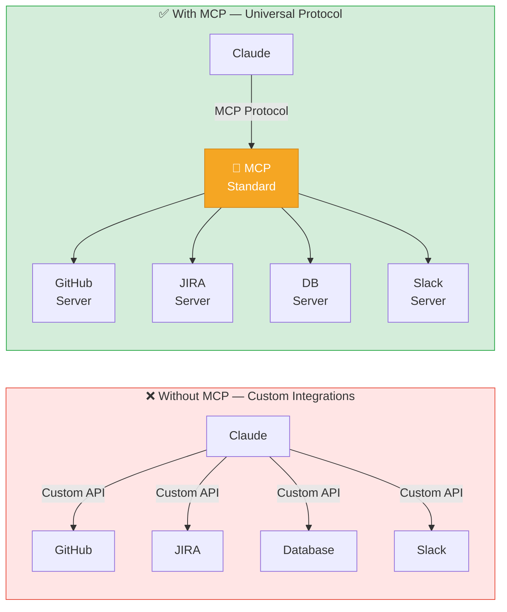
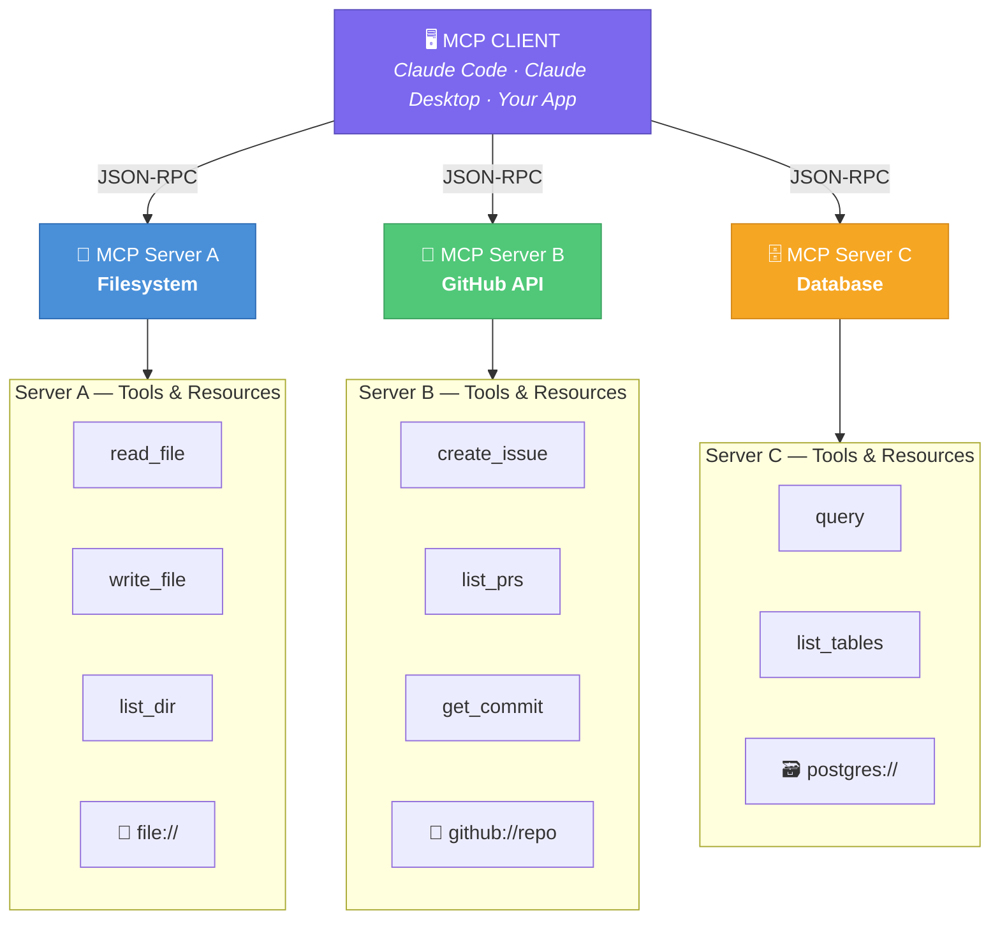
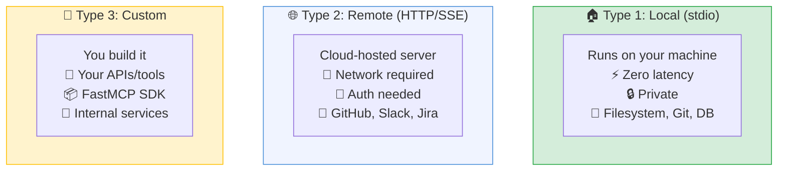
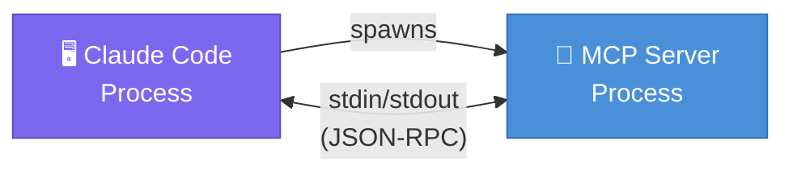

# Article 9: What Are MCPs? A Developer's Complete Guide to Model Context Protocol

> *MCPs transform Claude from a chat interface into an agent that can read your files, query your databases, call your APIs, and interact with your tools — all within a single conversation.*

---

## Introduction

Imagine asking Claude: "What were the three most common error types in production last week, and create a JIRA ticket for the most critical one with the relevant stack traces attached?"

Without MCPs, Claude can't do this — it has no access to your logs, your JIRA, or anything outside the conversation window. With the right MCPs configured, this becomes a single prompt that Claude executes end-to-end.

MCPs — Model Context Protocol — are one of the most significant developments in practical AI tooling. They're what transforms Claude from a smart chat assistant into an autonomous agent that operates within your actual development environment.

---

## 1. What Is Model Context Protocol (MCP)?

Model Context Protocol is an **open standard** developed by Anthropic that defines how AI models communicate with external tools and data sources. It's essentially a universal adapter — a standardised interface that allows any AI model to connect to any external service, following a common protocol.

**The core idea:** Instead of hardcoding integrations between models and tools, MCP provides a standard so that any MCP-compliant tool can connect to any MCP-compliant model.

Think of it like USB for AI tools:
- Before USB, every device had a proprietary connector
- USB standardised device communication
- MCP standardises AI tool communication



---

## 2. The MCP Architecture



**Three core primitives in MCP:**

1. **Tools** — Actions Claude can execute (read file, create issue, run query)
2. **Resources** — Data sources Claude can read (files, database records, API responses)
3. **Prompts** — Pre-built prompt templates exposed by the server

---

## 3. Types of MCP Servers




### Type 1: Local MCP Servers (stdio)

Local servers run as processes on the same machine as Claude Code. They communicate via standard input/output (stdio) — no network required.

**How they work:**


**Characteristics:**
- Run locally on developer's machine
- Fast (no network latency)
- Full access to local filesystem and resources
- No authentication needed for local resources
- Private — no data leaves the machine

**Best for:**
- Filesystem access
- Local database connections
- Running local scripts and commands
- Local Docker containers
- Git repository access

**Examples:**
- `@modelcontextprotocol/server-filesystem` — Read/write local files
- `@modelcontextprotocol/server-git` — Git operations
- `@modelcontextprotocol/server-sqlite` — SQLite database access
- Custom local scripts

---

### Type 2: Remote MCP Servers (HTTP/SSE)

Remote servers run on a separate host and communicate via HTTP with Server-Sent Events (SSE) for streaming. They can be anywhere — cloud-hosted, company-internal, or third-party services.

**How they work:**
```
Claude Code → HTTPS request → Remote MCP Server → External API/Service
             ← SSE stream  ←
```

**Characteristics:**
- Can be shared across team members
- Access to cloud services and APIs
- Require authentication (API keys, OAuth)
- Network latency (but usually acceptable)
- Can be hosted by third parties

**Best for:**
- GitHub, GitLab, Bitbucket
- JIRA, Linear, Asana (project management)
- Slack, Teams (communication)
- AWS, GCP, Azure (cloud infrastructure)
- Databases (cloud-hosted)
- Third-party APIs

---

### Type 3: Custom MCP Servers

You can build your own MCP servers for internal tools, proprietary systems, or unique workflows.

**When to build custom MCP:**
- Your company has internal APIs not covered by existing MCPs
- You want to expose your database with domain-specific query tools
- You have proprietary data sources
- You want to enforce business rules in the MCP layer

```typescript
// Simple custom MCP server example (TypeScript)
import { Server } from "@modelcontextprotocol/sdk/server/index.js";
import { StdioServerTransport } from "@modelcontextprotocol/sdk/server/stdio.js";

const server = new Server(
  { name: "internal-api-server", version: "1.0.0" },
  { capabilities: { tools: {} } }
);

// Define a tool
server.setRequestHandler(ListToolsRequestSchema, async () => ({
  tools: [{
    name: "get_customer_data",
    description: "Retrieve customer data from internal CRM",
    inputSchema: {
      type: "object",
      properties: {
        customerId: { type: "string", description: "Customer UUID" }
      },
      required: ["customerId"]
    }
  }]
}));

// Implement the tool
server.setRequestHandler(CallToolRequestSchema, async (request) => {
  if (request.params.name === "get_customer_data") {
    const { customerId } = request.params.arguments;
    const data = await internalCRM.getCustomer(customerId);
    return { content: [{ type: "text", text: JSON.stringify(data) }] };
  }
});

const transport = new StdioServerTransport();
await server.connect(transport);
```

---

## 4. The MCP Ecosystem — Available Servers

### Official Anthropic MCP Servers

| Server | What It Does |
|---|---|
| `server-filesystem` | Read/write local files, directory listings |
| `server-git` | Git log, diff, commits, branches |
| `server-github` | Issues, PRs, repos, code search |
| `server-gitlab` | Issues, MRs, repos |
| `server-slack` | Send messages, search, read channels |
| `server-postgres` | Query PostgreSQL databases |
| `server-sqlite` | Query SQLite databases |
| `server-puppeteer` | Browser automation |
| `server-brave-search` | Web search |
| `server-memory` | Persistent key-value memory |
| `server-fetch` | HTTP requests to any URL |

### Community MCP Servers

The community has built hundreds more. Notable ones:

| Server | What It Does |
|---|---|
| `mcp-server-jira` | Create/update JIRA tickets |
| `mcp-server-linear` | Linear issue management |
| `mcp-server-aws` | AWS resource management |
| `mcp-server-kubernetes` | K8s cluster operations |
| `mcp-server-datadog` | Query logs and metrics |
| `mcp-server-notion` | Notion page creation/read |
| `mcp-server-figma` | Read Figma designs |
| `mcp-server-stripe` | Stripe payment operations |

---

## 5. Benefits of MCPs

### 5.1 Context Enrichment
Claude can pull real data into the conversation instead of relying on what you describe.

```
Without MCP: "Here's the error from our logs [paste 100 lines]..."
With MCP: "Check our Datadog logs for the payment service errors in the last hour"
```

### 5.2 Closed-Loop Action
Claude can not just suggest actions but execute them.

```
Without MCP: "Here's how to create that JIRA ticket..." [manual copy-paste]
With MCP: "Create a JIRA ticket for this bug with P1 priority and assign to the backend team"
```

### 5.3 Cross-Tool Workflows
MCPs enable multi-step workflows that span multiple tools in a single prompt.

```
"Find all failing tests in the last 3 GitHub Actions runs, 
create JIRA tickets for each unique failure, 
and post a summary to the #qa-alerts Slack channel."
```

Without MCPs: This is a 30-minute manual task.
With MCPs (GitHub + JIRA + Slack): Single prompt, ~30 seconds.

### 5.4 Team Consistency
Remote MCPs shared across a team mean everyone has the same tools and Claude behaves consistently for all team members.

### 5.5 Reduced Context Switching
Instead of opening GitHub, JIRA, Slack, and your terminal separately, you interact with all of them through Claude Code in your terminal.

---

## 6. When to Use Which Type

| Scenario | MCP Type | Reason |
|---|---|---|
| Reading local project files | Local (filesystem) | No network, full access |
| Querying your local dev DB | Local (postgres/sqlite) | Direct connection |
| Viewing git history | Local (git) | Fastest, no auth needed |
| Creating GitHub issues | Remote (github) | Needs GitHub API |
| Posting to Slack | Remote (slack) | Needs Slack API |
| Querying company data | Custom local/remote | Proprietary access |
| Cloud infra management | Remote (aws/gcp) | Cloud API required |
| Browser automation | Local (puppeteer) | Needs local browser |
| Web research | Remote (brave-search) | External search API |
| Persistent memory | Local (memory) | Privacy, speed |

---

## 7. MCP Security Considerations

MCPs grant Claude **real capabilities with real consequences**. Before adding any MCP, ask: "If Claude used this incorrectly, what is the worst-case outcome?"

### Risk Rating by MCP Type

| MCP Type | Risk Level | Worst-Case Scenario | Mitigation |
| :--- | :---: | :--- | :--- |
| Filesystem (read-only) | 🟢 Low | Claude reads a file it shouldn't | Scope to project directory only |
| Filesystem (write access) | 🔴 High | Claude deletes or corrupts files | Add confirmation for destructive ops |
| Production database (write) | 🔴 Critical | Data loss or corruption | Use read-only creds in dev; never prod write |
| Development database (write) | 🟡 Medium | Dev data corrupted | Acceptable with backups |
| GitHub (read) | 🟢 Low | Claude reads private repos | Use scoped personal access token |
| GitHub (write) | 🟡 Medium | Claude pushes unwanted commits | Require PR review before merge |
| Slack / Email | 🟡 Medium | Claude sends unintended messages | Review before posting; use draft mode |
| AWS / Cloud (read) | 🟡 Medium | Claude reads sensitive infra config | Use read-only IAM role |
| AWS / Cloud (write) | 🔴 Critical | Infrastructure created/deleted | Never grant; use read-only only |

### Best Practices

1. **Principle of Least Privilege** — only install MCPs Claude actually needs
2. **Read-only by default** — use read-only credentials wherever possible
3. **Scoped credentials** — create dedicated API tokens for AI tool access with minimal scopes
4. **Directory scoping** — restrict filesystem MCP to project directories, not `~` or `/`
5. **Confirm before irreversible operations** — Claude will ask; always verify before confirming
6. **Audit trail** — use MCPs that log actions (e.g. git-backed writes)

---

## 8. Real-World Workflow Examples

### Workflow: Incident Response
```
MCPs required: Datadog (logs), GitHub (code), JIRA (tickets), Slack (comms)

"We have an incident — payment service is returning 500s. 
1. Check Datadog for error patterns in the last 30 minutes
2. Find the last 3 commits to the payment-service repo
3. Identify which commit likely caused the issue
4. Create a P0 JIRA incident ticket with findings
5. Post incident status to #incidents Slack channel"
```

### Workflow: Sprint Planning Assistance
```
MCPs required: GitHub (PRs, issues), JIRA (backlog), Confluence (specs)

"Prepare sprint planning materials:
1. List all open JIRA tickets in the backlog, sorted by priority
2. For each P0/P1 ticket, find related GitHub issues or PRs
3. Summarise any associated technical specs from Confluence
4. Suggest a sprint scope based on our team velocity of 40 points"
```

### Workflow: Automated Code Review
```
MCPs required: GitHub (PRs, code), Slack (notifications)

"Review PR #247:
1. Read the full diff
2. Check if it has sufficient test coverage
3. Look for security issues using our security checklist
4. Post a detailed code review comment on the PR
5. If critical issues found, notify @dev-lead in Slack"
```

---

## Summary

MCPs are the technology that makes Claude agentic — capable of taking actions in the real world, not just generating text. Understanding the three types:

1. **Local MCPs (stdio)** — For filesystem, local DB, git. Fast, private, no auth.
2. **Remote MCPs (HTTP/SSE)** — For cloud services (GitHub, JIRA, Slack, AWS). Shared across teams.
3. **Custom MCPs** — For proprietary internal systems. Built for your specific needs.

The key question when evaluating an MCP is: "What actions does this enable, and do I want Claude to be able to take those actions autonomously?"

In the final article, we'll get hands-on with MCP setup — exactly how to configure local and remote MCPs in Claude Code, including authentication, troubleshooting, and team deployment.

---

*Next: Article 10 — How to Set Up MCPs: Local and Remote Configuration Guide*
