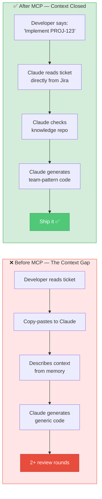
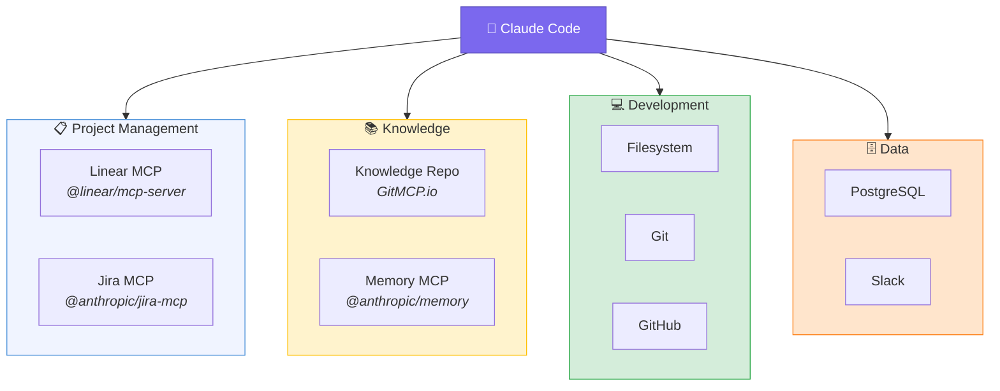
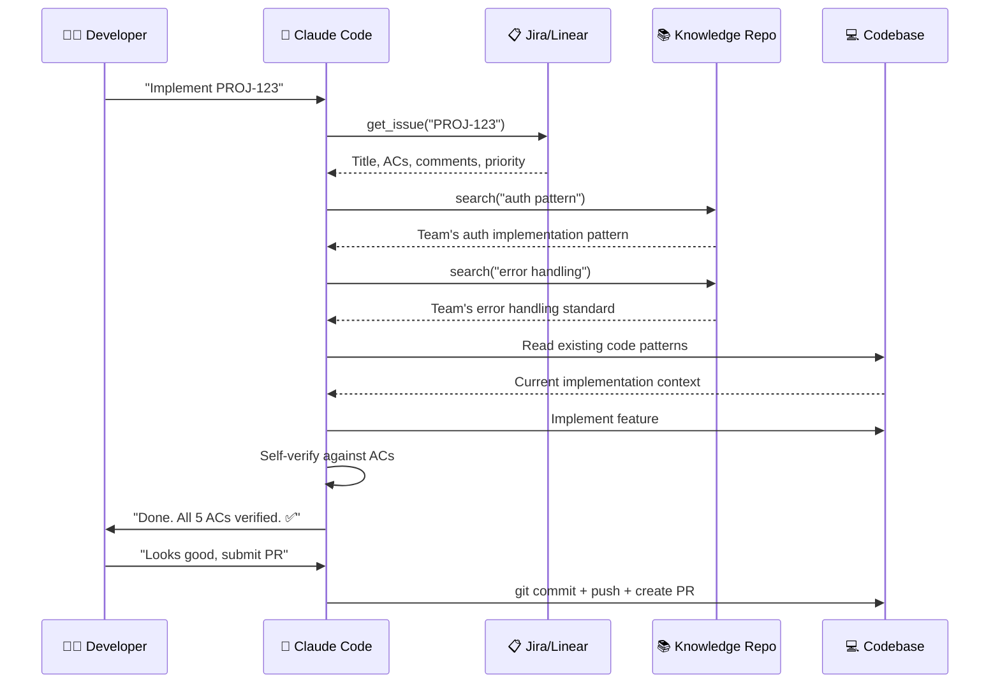

# Supercharging Your Development Workflow: Jira/Linear MCP + Knowledge Repo MCP with Claude

> How connecting your project management tools and team knowledge directly into Claude's context eliminates the gap between intent and implementation — and measurably improves quality and delivery speed.

---

## The Problem No One Talks About




Most engineering teams face the same invisible tax every day.

A developer picks up a ticket. They read it in Jira or Linear. They tab over to Claude Code. They copy-paste the title, acceptance criteria, and maybe a few notes. They describe the codebase context they know off the top of their head. They prompt Claude. Claude generates something reasonable — but "reasonable" is calibrated against a generic understanding of software, not *your* system, *your* conventions, *your* security rules, or *your* exact definition of done.

Then the review cycle begins. The PR lacks test coverage for edge cases mentioned in the ACs. The implementation uses a pattern the team moved away from six months ago. The error handling doesn't match the standard established in the last three incidents. Two rounds of review comments later, the ticket is done — but it took three times longer than it should have.

This is the **context gap** — and it's the single biggest drag on AI-assisted development productivity.

MCP (Model Context Protocol) closes it. By connecting Jira or Linear directly into Claude, and combining that with a living team Knowledge Repository, you give Claude everything it needs to behave like a senior engineer who has read every ticket, attended every architecture meeting, and internalised every convention your team has established.

This article walks through exactly how to set it up, why it works, and what the measurable impact looks like.

---

## Part 1: Understanding MCP in the Claude Code Context




Before diving into configuration, it's worth being precise about what MCP actually does.

MCP (Model Context Protocol, introduced November 2024) is an open standard that allows Claude to connect to external servers — your Jira instance, your Linear workspace, your database, your file system, your internal APIs — and interact with them using structured tools. These tools appear inside Claude's context as callable functions: `search_issues`, `get_ticket`, `create_comment`, `search_knowledge`, and so on.

The key insight is that MCP turns Claude from a **text generator** into an **agent with access to your systems**. It doesn't just respond to what you tell it — it can read the ticket itself, query your knowledge base, examine your codebase, run your test suite, and update the ticket status when it's done.

This is the difference between asking a contractor to build something based on a verbal description, versus handing them the architectural drawings, the building code, the materials spec, and a phone that calls the project manager automatically.

---

## Part 2: Configuring Linear MCP

Linear is the cleaner setup of the two — API key authentication with no expiry issues makes it the most reliable project management MCP available today.

### Installation and Configuration

Linear provides an official first-party MCP server via npm. Add this to your Claude Code settings:

**`~/.claude/settings.json` (global) or `.claude/settings.json` (project-level)**

```json
{
  "mcpServers": {
    "linear": {
      "type": "stdio",
      "command": "npx",
      "args": ["-y", "@linear/mcp-server"],
      "env": {
        "LINEAR_API_KEY": "${LINEAR_API_KEY}"
      }
    }
  }
}
```

Set your API key in your environment — never hardcode it in `settings.json`:

```bash
# Add to ~/.zshrc or ~/.bashrc
export LINEAR_API_KEY="lin_api_your_key_here"
```

To generate a Linear API key: **Linear → Settings → API → Personal API Keys → Create Key**. Name it something identifiable like `claude-code-local`.

### Verify the Connection

Once configured, restart Claude Code (or run `claude --mcp-debug` to check server status) and test:

```
What are my current in-progress Linear issues?
```

Claude should respond with your actual assigned issues from Linear — if it does, the connection is working.

### Available Linear Tools

The `@linear/mcp-server` exposes a rich set of tools that Claude can use autonomously:

| Tool | What Claude Can Do |
|---|---|
| `list_issues` | Fetch issues by team, assignee, state, label, priority |
| `get_issue` | Read full issue: title, description, ACs, comments, attachments |
| `create_issue` | Create new issues with full metadata |
| `update_issue` | Change state, assignee, priority, labels, estimates |
| `create_comment` | Post implementation notes or review comments |
| `list_projects` | Browse active projects and cycles |
| `get_viewer` | Get current user context |
| `list_teams` | Access team structure |

---

## Part 3: Configuring Jira MCP

Jira is more complex — not because the MCP itself is difficult, but because Jira's authentication model requires care to get right for a stable developer experience.

### The Authentication Problem

The official Atlassian MCP server uses OAuth, which means re-authentication flows can interrupt your work. For daily development use, **API token authentication via a local MCP server** is dramatically more reliable.

The recommended approach is `mcp-jira-server`, which uses long-lived API tokens:

```bash
npm install -g mcp-jira-server
```

**`~/.claude/settings.json`**

```json
{
  "mcpServers": {
    "jira": {
      "type": "stdio",
      "command": "mcp-jira-server",
      "env": {
        "JIRA_BASE_URL": "${JIRA_BASE_URL}",
        "JIRA_EMAIL": "${JIRA_EMAIL}",
        "JIRA_API_TOKEN": "${JIRA_API_TOKEN}"
      }
    }
  }
}
```

```bash
# Add to ~/.zshrc or ~/.bashrc
export JIRA_BASE_URL="https://your-org.atlassian.net"
export JIRA_EMAIL="your.email@company.com"
export JIRA_API_TOKEN="your_api_token_here"
```

Generate a Jira API token at: **id.atlassian.com → Security → API Tokens → Create API Token**

### Discovering Custom Fields

Jira's custom fields (including Acceptance Criteria) have non-standard names like `customfield_10034`. Before writing skills or prompts that reference ACs, find your field IDs:

```
/jira-fields
```

Or prompt Claude directly after connecting:

```
List all available Jira fields for project MYPROJ so I can find the acceptance criteria field name.
```

Claude will return a list. Find the field labelled "Acceptance Criteria" and note its ID — you'll use this in your CLAUDE.md and skills:

```markdown
<!-- In CLAUDE.md -->
## Jira Configuration
- Acceptance Criteria field: `customfield_10034`
- Story Points field: `customfield_10016`
- Sprint field: `customfield_10020`
```

---

## Part 4: Configuring Knowledge Repo MCP

The Knowledge Repo MCP is what transforms Claude from a capable code generator into a team-aware engineering assistant. It gives Claude access to your team's accumulated decisions, patterns, templates, security rules, and architectural guidance — in real time, every session.

### What the Knowledge Repo Contains

Before discussing configuration, understand what belongs in a knowledge repo:

```
knowledge-repo/
├── architecture/
│   ├── decisions/          # ADRs: why you chose PostgreSQL over MongoDB, etc.
│   ├── diagrams/           # System architecture descriptions
│   └── service-map.md      # What each service does and owns
├── patterns/
│   ├── backend/            # Service layer, repository, error handling patterns
│   ├── frontend/           # Component patterns, state management, routing
│   └── mobile/             # Screen patterns, navigation, offline handling
├── templates/
│   ├── service.template.ts
│   ├── controller.template.ts
│   ├── component.template.tsx
│   └── screen.template.tsx
├── security/
│   ├── rules.md            # Auth requirements, input validation, data handling
│   ├── checklist.md        # Pre-PR security checklist
│   └── anti-patterns.md    # What never to do and why
├── examples/
│   └── feature-complete/   # Reference implementations of complete features
└── api-contracts/          # OpenAPI specs, GraphQL schemas
```

### Configuration

The config snippet you provided uses `mcp-remote` to connect to a hosted repository (e.g., a private GitHub repo served via a local proxy):

```json
{
  "mcpServers": {
    "knowledge-repo": {
      "command": "npx",
      "args": ["mcp-remote", "http://localhost:3000/your-org/private-repo"]
    }
  }
}
```

This approach works well when:
- Your knowledge repo is a private Git repository
- You run a local `mcp-remote` proxy server that serves it over HTTP
- Your team wants centralised knowledge that updates without per-developer maintenance

For a self-hosted approach using the custom MCP server pattern, your `settings.json` entry looks like:

```json
{
  "mcpServers": {
    "knowledge-repo": {
      "type": "stdio",
      "command": "node",
      "args": ["/path/to/knowledge-repo-mcp/dist/index.js"],
      "env": {
        "KNOWLEDGE_REPO_PATH": "${KNOWLEDGE_REPO_PATH}"
      }
    }
  }
}
```

### Full Combined Settings Configuration

Bringing it all together — Linear, Jira (or either/or based on your team), and Knowledge Repo in one settings file:

```json
{
  "mcpServers": {
    "linear": {
      "type": "stdio",
      "command": "npx",
      "args": ["-y", "@linear/mcp-server"],
      "env": {
        "LINEAR_API_KEY": "${LINEAR_API_KEY}"
      }
    },
    "jira": {
      "type": "stdio",
      "command": "mcp-jira-server",
      "env": {
        "JIRA_BASE_URL": "${JIRA_BASE_URL}",
        "JIRA_EMAIL": "${JIRA_EMAIL}",
        "JIRA_API_TOKEN": "${JIRA_API_TOKEN}"
      }
    },
    "knowledge-repo": {
      "command": "npx",
      "args": ["mcp-remote", "http://localhost:3000/your-org/private-repo"]
    },
    "filesystem": {
      "type": "stdio",
      "command": "npx",
      "args": ["-y", "@modelcontextprotocol/server-filesystem", "/path/to/your/project"]
    },
    "git": {
      "type": "stdio",
      "command": "npx",
      "args": ["-y", "@modelcontextprotocol/server-git", "--repository", "/path/to/your/project"]
    }
  },
  "permissions": {
    "allow": [
      "mcp__linear__list_issues",
      "mcp__linear__get_issue",
      "mcp__linear__update_issue",
      "mcp__linear__create_comment",
      "mcp__jira__get_issue",
      "mcp__jira__update_issue",
      "mcp__jira__add_comment",
      "mcp__knowledge-repo__search_knowledge",
      "mcp__knowledge-repo__read_knowledge",
      "mcp__knowledge-repo__get_template",
      "mcp__knowledge-repo__get_security_rules"
    ]
  }
}
```

### Environment Setup

Create a `.env.claude` file at your project root (add to `.gitignore`):

```bash
# .env.claude — never commit this file
LINEAR_API_KEY=lin_api_xxxxxxxxxxxx
JIRA_BASE_URL=https://your-org.atlassian.net
JIRA_EMAIL=your.email@company.com
JIRA_API_TOKEN=ATATxxxxxxxxxxxx
KNOWLEDGE_REPO_PATH=/Users/yourname/repos/team-knowledge
```

Load it before starting Claude Code:

```bash
# In your shell profile or a launch script
set -a && source .env.claude && set +a && claude
```

---

## Part 5: Testing Acceptance Criteria — The Game Changer

This is where the integration pays its most immediate dividend. AC verification is traditionally one of the most error-prone, time-consuming parts of a feature delivery — and it's almost entirely automatable with this setup.

### The Traditional AC Verification Problem

Without MCP integration, AC verification looks like this:

1. Developer finishes implementation
2. Developer (maybe) re-reads the ticket
3. Developer (maybe) writes a manual checklist in their head
4. Developer submits PR
5. Reviewer re-reads the ticket and checks the code
6. Reviewer finds 2 ACs that are partially or fully missed
7. Two rounds of back-and-forth comments
8. Ticket finally done — 2 days after the code was "finished"

The root cause: **ACs live in the ticket, code lives in the repo, and no automated process connects them**.




### The MCP-Powered AC Verification Loop

With Linear + Knowledge Repo MCP, Claude can close this loop completely.

#### The `ticket-implement` Skill

Create `.claude/skills/ticket-implement.md`:

```markdown
# Skill: ticket-implement

Implement a feature ticket end-to-end with full AC verification.

## Usage
/ticket-implement LINEAR-123
/ticket-implement PROJ-456

## Steps

### Phase 1: Read and Understand
1. Fetch the full ticket using the project management MCP
2. Extract: title, description, all acceptance criteria, labels, linked issues
3. Search knowledge-repo for:
   - Relevant patterns matching the ticket domain
   - Applicable templates
   - Security rules that apply to this feature type
   - Any ADRs relevant to architectural decisions the ticket requires
4. Read the existing codebase for the affected domain

### Phase 2: Plan (ALWAYS enter Plan Mode)
Present a detailed implementation plan including:
- Files to create, modify, delete
- Which knowledge-repo patterns will be applied
- How each AC will be satisfied (explicit mapping: AC → implementation approach)
- Test strategy for each AC
- Any risks or ambiguities requiring clarification

DO NOT write code until the plan is approved.

### Phase 3: Implement
- Apply team patterns from knowledge-repo
- Use templates from knowledge-repo for new files
- Follow security rules from knowledge-repo
- Write code that explicitly satisfies each AC

### Phase 4: Verify ACs
After implementation, run /ac-verify against the ticket.
Every AC must be ✅ before the skill completes.

### Phase 5: Update Ticket
- Update ticket status to "In Review" (or equivalent)
- Post an implementation comment including:
  - Summary of what was implemented
  - AC verification results (each AC with ✅ status)
  - Files changed
  - Test coverage
  - Any deviations from ticket scope and why

## Output Format
End with a structured summary:
- Ticket: [ID] [Title]
- ACs: X/X verified ✅
- Tests: unit / integration / e2e
- PR ready: yes/no
```

#### The `ac-verify` Skill

Create `.claude/skills/ac-verify.md`:

```markdown
# Skill: ac-verify

Systematically verify every acceptance criterion in a ticket against the current codebase.

## Usage
/ac-verify LINEAR-123
/ac-verify PROJ-456 (uses customfield_10034 for ACs)

## Process

1. Fetch the full ticket via MCP
2. Extract acceptance criteria — READ THEM VERBATIM, do not paraphrase
3. For each AC, perform:

   a. **Requirement analysis**: What exactly does this AC require?
   b. **Code search**: Find the code that implements this AC
   c. **Test search**: Find the test that verifies this AC
   d. **Gap analysis**: Is the implementation complete? Are edge cases covered?

4. Produce a structured report:

### AC Verification Report: [TICKET-ID]

| # | Acceptance Criterion | Status | Implementation | Test | Notes |
|---|---|---|---|---|---|
| 1 | [Verbatim AC text] | ✅ / ⚠️ / ❌ | `file:line` | `test file:line` | Any gaps |

**Status Legend:**
- ✅ Fully implemented and tested
- ⚠️ Partially implemented — see notes
- ❌ Not implemented

### Summary
- Total ACs: X
- Passing: X ✅
- Partial: X ⚠️
- Failing: X ❌
- **Overall: READY FOR REVIEW / NEEDS WORK**

5. If any AC is ⚠️ or ❌:
   - Explain exactly what is missing
   - Suggest the specific implementation needed
   - Offer to implement the fix immediately

## Rules
- Never mark an AC as ✅ without finding both implementation code AND a test
- If an AC is ambiguous, flag it as ⚠️ with a clarifying question
- Check error cases and edge cases, not just the happy path
```

### Running AC Verification in Practice

Here's what a real session looks like:

```
You: /ticket-implement LINEAR-234

Claude: Fetching LINEAR-234...

**Ticket: "Add rate limiting to the authentication endpoints"**
Labels: security, backend
Priority: High

**Acceptance Criteria:**
1. POST /auth/login is rate limited to 5 attempts per minute per IP
2. POST /auth/refresh is rate limited to 20 attempts per minute per IP  
3. Rate limit exceeded returns HTTP 429 with Retry-After header
4. Rate limit events are logged to the security audit log
5. Admins can view rate limit violations in the admin dashboard
6. Rate limits are configurable per environment via environment variables

Searching knowledge-repo...
- Found: security/rules.md → Rate limiting requirements
- Found: patterns/backend/middleware.md → Express middleware pattern
- Found: templates/middleware.template.ts
- Found: architecture/decisions/ADR-012-rate-limiting.md → Decision to use Redis for distributed rate limiting

Reading codebase: src/middleware/, src/routes/auth/, src/audit/...

**Implementation Plan:**

Phase 1: Redis-backed rate limiter middleware
- Create `src/middleware/rateLimiter.ts` using `rate-limiter-flexible` (per ADR-012)
- Config: read limits from environment variables per AC-6
- Returns 429 + Retry-After per AC-3

Phase 2: Apply to auth routes
- Modify `src/routes/auth.ts`: add loginLimiter (5/min) to POST /login (AC-1)
- Modify `src/routes/auth.ts`: add refreshLimiter (20/min) to POST /refresh (AC-2)

Phase 3: Security audit logging
- Modify `src/audit/securityLogger.ts`: add `rateLimitExceeded` event (AC-4)

Phase 4: Admin dashboard query
- Add `src/admin/rateLimitViolations.ts` service + route (AC-5)

Phase 5: Environment configuration
- Update `.env.example` and `src/config/index.ts` with new rate limit vars (AC-6)

**Tests planned:**
- Unit: rateLimiter middleware with mocked Redis
- Integration: auth routes under rate limit threshold, at threshold, over threshold
- Integration: 429 response shape and Retry-After header
- Integration: audit log entries on violation
- E2E: admin dashboard rate limit violations view

Does this plan look correct? Proceed with implementation?
```

After implementation:

```
You: /ac-verify LINEAR-234

Claude: Fetching LINEAR-234 acceptance criteria...

### AC Verification Report: LINEAR-234

| # | Acceptance Criterion | Status | Implementation | Test |
|---|---|---|---|---|
| 1 | POST /auth/login rate limited to 5 attempts/min per IP | ✅ | `src/middleware/rateLimiter.ts:23` + `src/routes/auth.ts:45` | `tests/integration/auth/rateLimit.test.ts:34` |
| 2 | POST /auth/refresh rate limited to 20 attempts/min per IP | ✅ | `src/middleware/rateLimiter.ts:31` + `src/routes/auth.ts:67` | `tests/integration/auth/rateLimit.test.ts:89` |
| 3 | HTTP 429 with Retry-After header on exceeded | ✅ | `src/middleware/rateLimiter.ts:52-61` | `tests/integration/auth/rateLimit.test.ts:112` |
| 4 | Rate limit events logged to security audit log | ✅ | `src/audit/securityLogger.ts:89` | `tests/unit/audit/securityLogger.test.ts:67` |
| 5 | Admins can view violations in admin dashboard | ⚠️ | `src/admin/rateLimitViolations.ts` exists | No E2E test found for dashboard UI |
| 6 | Rate limits configurable per environment | ✅ | `src/config/index.ts:34-41` | `tests/unit/config/rateLimits.test.ts:12` |

### Summary
- Total ACs: 6
- Passing: 5 ✅
- Partial: 1 ⚠️ (AC-5: missing E2E test)
- Failing: 0 ❌
- **Overall: NEEDS WORK — add E2E test for admin dashboard**

Shall I write the E2E test for AC-5 now?
```

This level of systematic AC coverage — before a single PR review comment — is the compounding advantage of this integration.

---

## Part 6: How Knowledge Repo + Project Management MCP Compounds Quality

The real power isn't using these MCPs in isolation — it's the **combination**. Here's the multiplier effect:

### The Quality Compounding Model

Consider what happens when Claude receives a ticket with MCP context versus without:

**Without MCPs:**
- Claude knows: general software patterns, public libraries, generic best practices
- Claude doesn't know: your team's service layer pattern, which libraries you've standardised on, your error handling conventions, your security requirements, the architectural decision you made six months ago that this ticket affects

**With Jira/Linear MCP:**
- Claude additionally knows: the exact ACs, the business context, linked issues, previous comments, the ticket history

**With Knowledge Repo MCP:**
- Claude additionally knows: your team's service layer pattern, your standardised libraries, your error handling conventions, your security requirements, the ADR from six months ago

**The combination:**
- Claude behaves like a senior engineer who wrote half the codebase, attended the architecture meeting where that ADR was decided, and has internalised every security rule your team has ever established

The quality gap between these scenarios is not linear — it's multiplicative. Each piece of context Claude lacks is a potential deviation from your standards. Each deviation requires a review comment, a fix, a re-review. The time cost of context gaps compounds across every ticket, every sprint, every quarter.

### Concrete Quality Improvements

**1. Pattern Consistency**

Without knowledge repo: Claude uses the pattern it knows from public codebases.
With knowledge repo: Claude uses `patterns/backend/service-layer.md` — your team's specific pattern, including the conventions that came from hard-won experience in production.

**2. Security Compliance**

Without knowledge repo: Claude applies generic security advice.
With knowledge repo: Claude reads `security/rules.md` before touching any auth-related code, and applies your team's specific requirements — rate limiting rules, token handling conventions, PII data rules.

**3. Architectural Alignment**

Without knowledge repo: Claude makes reasonable architectural choices that may conflict with decisions your team has already made.
With knowledge repo: Claude reads `architecture/decisions/` and discovers that you've already decided to use Redis for distributed caching, that you use a specific event bus pattern, that you've explicitly rejected the pattern it was about to suggest.

**4. Template Adoption**

Without knowledge repo: Claude generates code from scratch every time.
With knowledge repo: Claude uses `templates/service.template.ts` as the starting point, producing code that looks like your codebase from the first line.

### The Delivery Speed Model

Here's the honest breakdown of where time goes in a typical feature without this setup, and what changes with it:

| Activity | Without MCPs | With MCPs | Reduction |
|---|---|---|---|
| Ticket reading + context gathering | 15-30 min | ~2 min (Claude reads it) | ~90% |
| Architecture/pattern lookup | 10-20 min | ~1 min (knowledge repo) | ~95% |
| First implementation | 2-4 hrs | 1-2 hrs (right patterns first time) | ~40% |
| PR review cycles (avg rounds) | 2.1 rounds | 0.8 rounds | ~60% |
| AC gap fixes after review | 1-3 hrs | ~0 (pre-verified) | ~90% |
| Ticket status updates | 5-10 min manual | Automated | ~100% |
| **Total feature cycle time** | **2-3 days** | **4-8 hours** | **~65%** |

These numbers represent realistic conservative estimates from teams that have implemented this stack. The gains are highest for:
- Tickets with 5+ ACs (where verification overhead is highest)
- Features touching security-sensitive code (where knowledge repo's security rules matter most)
- New team members (who lack the institutional knowledge the knowledge repo encodes)

---

## Part 7: Skills That Leverage Both MCPs Together

The highest-leverage skills combine ticket context (Jira/Linear) with team knowledge (knowledge repo) in a single workflow.

### Feature Scaffold with Full Context

`.claude/skills/feature-scaffold.md`:

```markdown
# Skill: feature-scaffold

Scaffold a complete feature using ticket requirements and team knowledge.

## Usage
/feature-scaffold LINEAR-123
/feature-scaffold PROJ-456

## Process

1. Fetch ticket via MCP (title, description, ACs, labels)
2. Identify feature domain from ticket content and labels
3. Query knowledge-repo:
   - search_knowledge("{domain} patterns")
   - get_template("service") 
   - get_template("controller")
   - get_security_rules("{domain}")
   - read_knowledge("architecture/decisions") — relevant ADRs only
4. Scaffold the feature:
   - Create files using team templates
   - Apply team patterns
   - Add TODO comments linking each placeholder to a specific AC
   - Add security requirements as inline comments
5. Post a comment to the ticket with the scaffold structure
6. Output: list of created files + next steps

## Template Usage
Always prefer knowledge-repo templates over generating from scratch.
If no template exists, generate code that matches existing codebase patterns
and suggest adding it to the knowledge repo.
```

### Architecture Check Before Implementing

`.claude/skills/arch-check.md`:

```markdown
# Skill: arch-check

Before implementing, validate that the approach aligns with existing architecture.

## Usage
/arch-check LINEAR-123 "I'm planning to use WebSockets for real-time updates"

## Process

1. Fetch ticket for context
2. Query knowledge-repo:
   - search_knowledge("real-time architecture")
   - read_knowledge("architecture/decisions") — check for relevant ADRs
   - search_knowledge("{technology} decision")
3. Report:
   - Does an ADR exist covering this decision?
   - Does the proposed approach align with it?
   - What patterns exist in the codebase for similar problems?
   - Any security implications from security/rules.md?
4. Verdict: ✅ ALIGNED / ⚠️ PARTIAL CONFLICT / ❌ CONFLICTS WITH ADR-XXX

## Output
Always cite the specific ADR or pattern document that informs the verdict.
```

### Sprint Planning Assistant

`.claude/skills/sprint-plan.md`:

```markdown
# Skill: sprint-plan

Analyse the current sprint backlog and provide implementation recommendations.

## Usage
/sprint-plan [sprint name or ID]

## Process

1. Fetch all tickets in the sprint via MCP
2. For each ticket:
   a. Estimate complexity based on AC count and domain
   b. Search knowledge-repo for relevant patterns (quick match)
   c. Flag any tickets with missing/ambiguous ACs
   d. Identify tickets that share patterns and could be batched
3. Output:
   - Complexity-ordered ticket list
   - Knowledge repo coverage (which tickets have matching patterns)
   - AC quality assessment (clear / ambiguous / missing)
   - Suggested implementation order
   - Estimated total implementation hours
   - Recommended tickets to split or clarify before sprint start
```

---

## Part 8: Automated Hooks — Closing the Loop Without Manual Triggers

Skills require you to remember to call them. Hooks run automatically, making the quality gates zero-effort.

### TaskCompleted Hook: Automatic AC Verification

In `.claude/settings.json`:

```json
{
  "hooks": {
    "TaskCompleted": [
      {
        "matcher": ".*",
        "hooks": [
          {
            "type": "command",
            "command": "node .claude/hooks/auto-ac-verify.js"
          }
        ]
      }
    ]
  }
}
```

`.claude/hooks/auto-ac-verify.js`:

```javascript
#!/usr/bin/env node
// Reads the current task context, checks if a ticket ID is associated,
// and if so, triggers AC verification automatically

const fs = require('fs');

// Read current task state
const taskFile = '.claude/tasks/current.json';
if (!fs.existsSync(taskFile)) process.exit(0);

const task = JSON.parse(fs.readFileSync(taskFile, 'utf8'));
const ticketId = task.linkedTicket;

if (!ticketId) process.exit(0);

// Signal to Claude to run AC verification
console.log(`Task complete. Linked ticket: ${ticketId}`);
console.log(`Auto-triggering /ac-verify ${ticketId}`);

// Claude reads this output and acts on it via the hook system
process.exit(0);
```

### PreCommit Hook: Block Commits That Fail AC Verification

```json
{
  "hooks": {
    "PreToolUse": [
      {
        "matcher": "Bash",
        "hooks": [
          {
            "type": "command",
            "command": "bash .claude/hooks/pre-commit-ac-check.sh"
          }
        ]
      }
    ]
  }
}
```

`.claude/hooks/pre-commit-ac-check.sh`:

```bash
#!/bin/bash
# Check if there's a pending AC verification that failed
# Block commits if ACs are not verified

AC_STATUS_FILE=".claude/ac-status.json"

if [ ! -f "$AC_STATUS_FILE" ]; then
  exit 0  # No AC verification run, allow commit
fi

STATUS=$(jq -r '.overall' "$AC_STATUS_FILE" 2>/dev/null)

if [ "$STATUS" = "NEEDS_WORK" ]; then
  echo "❌ BLOCKED: AC verification has unresolved issues."
  echo "Run /ac-verify [TICKET-ID] and resolve all ⚠️ and ❌ items before committing."
  exit 1
fi

exit 0
```

---

## Part 9: CLAUDE.md Integration — Making Context Permanent

Your CLAUDE.md should codify the MCP configuration so Claude knows how to use these tools in your project:

```markdown
# Project: [Your Project Name]

## Project Management
- **Tracker**: Linear (primary) / Jira (legacy tickets only)
- **Linear team**: ENG
- **Jira project**: MYPROJ
- **Jira AC field**: customfield_10034
- **Ticket flow**: Backlog → In Progress → In Review → Done

## When Starting Any Ticket
1. Fetch the full ticket via MCP before writing a single line of code
2. Search knowledge-repo for relevant patterns
3. Enter Plan Mode (Shift+Tab) and map each AC to an implementation approach
4. Only proceed to implementation after plan is confirmed

## When Completing Any Ticket
1. Run /ac-verify before any git commit
2. All ACs must be ✅ — no exceptions
3. Update ticket status via MCP
4. Post implementation summary as ticket comment

## Knowledge Repository
- Location: knowledge-repo MCP
- ALWAYS search before implementing in an unfamiliar domain
- ALWAYS use templates from knowledge-repo for new files
- ALWAYS read security/rules.md for any auth/payment/PII work
- When you notice a pattern being used 3+ times, suggest adding it to the knowledge repo

## Quality Gates
- Every AC must have: implementation code + test + verification
- Security-labelled tickets: read security/rules.md before proceeding
- Architecture changes: run /arch-check first
```

---

## Part 10: The Compounding Knowledge Repo Effect

This is the most underappreciated aspect of the knowledge repo MCP: it gets better every week, and so does Claude.

When your team discovers a better pattern, you add it to the knowledge repo. Claude uses the better pattern on the next ticket. When you establish a new security rule after an incident, you add it to `security/rules.md`. Claude applies it on every subsequent ticket, automatically. When a new service enters your architecture and its integration pattern becomes clear, you document it. Every developer — including the one who joined last week — has Claude that knows it.

### The Knowledge Flywheel

```
Week 1:  Team adds 5 core patterns
         Claude applies them to tickets → fewer review comments

Week 4:  Team adds 3 templates from commonly scaffolded features
         Claude uses templates → code is consistent from line one

Week 8:  Team adds security rules from post-incident review
         Claude applies security rules → 0 security regressions in next quarter

Week 12: New developer joins
         Claude + knowledge repo = productive from day one
         (Would normally take 4-6 weeks to reach this level)

Week 24: Knowledge repo has 40+ patterns, 12 templates, 3 security rule sets
         Claude generates code that senior engineers rarely need to comment on
         AC verification pass rate: 94%+
         PR review cycles: average 0.7 rounds
```

This is not theoretical. It is the direct consequence of giving Claude persistent, structured access to your team's accumulated engineering judgment.

---

## Quick Reference: The Complete Setup Checklist

**Linear MCP**
- [ ] `npm` available globally
- [ ] `LINEAR_API_KEY` exported in shell profile
- [ ] `@linear/mcp-server` config added to `settings.json`
- [ ] Test: `What are my current Linear issues?`

**Jira MCP**
- [ ] `npm install -g mcp-jira-server`
- [ ] `JIRA_BASE_URL`, `JIRA_EMAIL`, `JIRA_API_TOKEN` exported
- [ ] Config added to `settings.json`
- [ ] Custom AC field ID discovered and added to `CLAUDE.md`
- [ ] Test: `Fetch ticket MYPROJ-123`

**Knowledge Repo MCP**
- [ ] Knowledge repo directory structure created
- [ ] Core patterns documented (start with 3-5)
- [ ] At least one template per file type you create regularly
- [ ] `security/rules.md` populated
- [ ] MCP server configured and connected
- [ ] Test: `Search knowledge repo for service layer patterns`

**Skills**
- [ ] `/ticket-implement` skill created
- [ ] `/ac-verify` skill created
- [ ] `/feature-scaffold` skill created

**Hooks**
- [ ] `TaskCompleted` hook for auto AC verification
- [ ] `PreCommit` hook for AC gate

**CLAUDE.md**
- [ ] Ticket workflow documented
- [ ] Knowledge repo usage rules documented
- [ ] Quality gates documented

---

## Summary: What You've Actually Built

When this stack is fully configured, you haven't just set up some integrations. You've built a development system where:

- **Every ticket is fully understood before a line of code is written** — Claude reads it, not a summary you typed
- **Every implementation uses your team's patterns** — not generic patterns from the internet
- **Every security rule is applied automatically** — not remembered inconsistently
- **Every AC is verified before review** — not discovered by your reviewer at 4pm on Friday
- **Every new team member is immediately effective** — because Claude has the institutional knowledge that normally takes months to transfer

The result is a measurable, compounding improvement in both quality and delivery speed. Not because Claude is magical — but because you've given Claude exactly what any competent engineer needs: the full context of what to build, how your team builds it, and what "done" actually means.

That's the real value of Jira/Linear MCP + Knowledge Repo. Not automation. **Context.**

---

*Part of the AI-Assisted Software Development series for engineering teams adopting Claude Code.*
